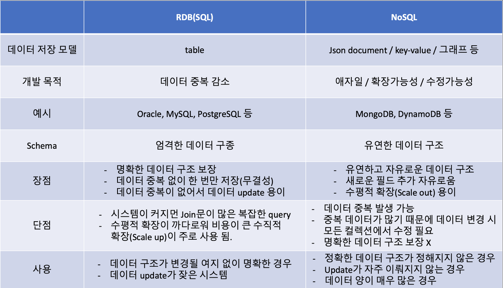
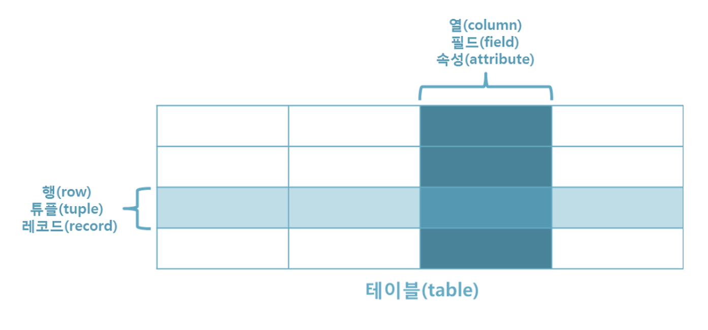

# 42gg 온보딩

- 2일차
    1. RDB, RDBMS
        
        *RDB
        
        → 관계형 데이터 베이스(Relational Database) : 데이타를 구성하는데 필요한 방법 중 하나로 모든 데이타를 2차원의 테이블 형태로 표현
        
        → 관계형 데이터베이스에 관계는 테이블 간에 관계를 의미하고 각 테이블 행들이 연결되어 상호작용 할 수 있도록 한다. 이 때 관계는 `1:1`, `1:N`, `N:M`로 구분 가능하다.
        
        *RDBMS
        
        → RDBMS는 관계형 데이터베이스를 생성하고 수정하고 관리할 수 있는 소프트웨어
        
    2. RDB와 NoSql의 차이
        
        → RDB는 엄격한 schema로 인해 데이터 중복이 없기 때문에 데이터 update가 많을 때와 데이터 구조가 명확하여 변경될 여지가 없는 경우 유리하고, NoSQL은 데이터 중복으로 인해 update 시 모든 컬렉션에서 수정이 필요하기 때문에 update가 적고 조회가 많을 때와 scale-out(수평적 확장)이 가능하므로 데이터 양이 매우 많은 경우에 유리하다.
        
        → NoSQL의 특징은 ACID, Transaction을 지원하지 않는다
        
        → RDB는 ACID와 Transaction을 보장하기 위해 수평적 확장이 쉽지가 않다. 또한, RDB의 경우 multiple server로 수평적 확장을 하게 되면 join을 하기 위해 상당히 복잡한 과정이 필요하다.
        
        
        
    3. 테이블, 컬럼, 스키마, 엔티티
    
    
    
    *테이블
    
    → 사전에 정의된 열의 데이터 타입대로 작성된 데이터가 행으로 축적.
    
    *컬럼
    
    → 테이블의 한 열의 데이터를 의미.
    
    *스키마
    
    → DB내에 어떤 구조로 데이터가 저장되는가를 나타내는 데이터베이스 구조
    
    → 개념 스키마 : 조직체 전체를 관장하는 입장에서 DB를 정의한 것. DBA는 개념 스키마를 통해서 전체적인 구조의 개념을 확인하고 DDL(데이터 정의어)과 DCL(데이터 제어어)을 사용해서 구조를 설계. 개체간의 관계와 제약조건 명시.
    
    → 내부 스키마 : 물리적인 저장장치 입장에서 DB가 저장되는 방법을 기술한 것. 구체적으로 개념 스키마를 디스크 기억장치에 물리적으로 구현하기 위한 방법을 기술한 것으로서 주된 내용은 실제로 저장될 내부레코드 형식, 내부레코드의 물리적 순서, 인덱스의 유/무 등에 관한 것입니다.
    
    → 외부 스키마(서브 스키마) : 사용자나 응용 프로그래머가 개인의 입장에서 필요한 데이터베이스의 논리적 구조를 정의. 실세계에 존재하는 데이터들을 어떤 형식, 구조, 배치 화면을 통해 사용자에게 보여줄 것인가. 응용 프로그래머가 외부 스키마를 통해 구조를 확인하고 DML(데이터 조작어)를 사용하여 데이터를 이용.
    
    *엔티티
    
    → 데이터의 집합을 의미한다. 저장되고, 관리되어야하는 데이터이다. 개념, 장소, 사건 등을 가리킨다. 유형 또는 무형의 대상을 가리킨다.
    
    → 식별자 : 유일한 식별자를 갖고 있어야 한다. ex) 주민번호, ID 등
    
    → 인스턴스 집합 : 2개 이상의 인스턴스가 있어야 한다.
    
    → 속성 : 반드시속성을 가지고 있어야 한다. ex) 학생에 학번, 이름, 주소 등
    
    → 관계 : 다른 엔티티와최소 한 개 이상 관계가 있어야 한다. ex) 학생은 이름을 갖고 있음.
    
    → 업무 : 업무에서 관리되어야 하는 집합이다. ex) 학생, 성적
    
    1. 데이터 모델링
        
        → 개념적 데이터 모델링 : 추상화 수준이 높고 업무중심적이고 포괄적인 수준의 모델린 진행. 전사적 데이터 모델링, EA수립시 많이 이용
        
        → 논리적 데이터 모델링 : 시스템으로 구축하고자 하는 업무에 대해 Key, 속성, 관계 등을 정확하게 표현, 재사용성이 높음
        
        → 물리적 데이터 모델링 : 실제로 데이터베이스에 이식할 수 있도록 성능, 저장 등 물리적인 성격을 고려하여 설계
        
        *데이터 정규화
        
        → 함수적 종속성(속성 간의 관계 분석)을 기반으로 해서 일정한 조건을 만족하는 형태로 엔티티를 분해하는 과정
        
        → 정규화 안했을 때 문제점 : 중복된 정보로 인한 문제, 특정 정보의 표현불가, NULL값 보유
        
        → 제 1 정규화 - Atomic Columns
        
        - 정의 : 복수의 속성 값을 갖는 속성을 분리하는 것 (중복과 반복을 없애는 것)
        - 원리 : 컬럼은 원자성을 가지며, 모든 속성은 반드시 값이 하나다.
        - 방법
            
            - 하나의 속성이 하나의 값을 가질 수 있도록 분해 (튜플 증가)
            
            - 여러 개의 속성 값을 갖는 속성을 다른 관계로 분해 (새로운 엔티티 생성)
            
        
        → 제 2 정규화 - No partial dependencies(부분 종속성)
        
        - 정의 : 부분 함수적 종속관계를 제거하는 것
        - 원리 : 모든 속성은 반드시 주식별자 속성에 종속되어야 한다.
        - 방법 : 복합키가 구성되었을 때 부분적으로 종속된 속성을 분해(새로운 엔티티 생성)
        
        → 제 3 정규화 - No transitive dependencies
        
        - 정의 : 이행 함수적 종속을 제거 (이행 규칙 : X → Y 이고 Y → Z 이면 X → Z 이다.)
        - 원리 : 주 식별자를 제외한 나머지 속성들은 상호 종속 관계여서는 안된다.
        - 방법 : 식별자 외에 속성들 간의 종속이 존재하지 않도록 관계를 분해
    2. 트랜젝션(Transection)과 ACID
        
        *트랜젝션
        
        → 트랜잭션이란 query를 하나의 묶음 처리해서 만약 중간에 실행이 중단됐을 경우, 처음부터 다시 실행하는 **Rollback**을 수행하고, 오류없이 실행을 마치면 **commit**을 하는 실행 단위를 의미합니다.
        
        즉, 한 번 쿼리가 실행되면 질의가 모두 수행되거나 모두 수행되지 않는 **작업수행의 논리적 단위**입니다.
        
        → 트랜잭션을 작업수행의 논리적 단위라고함, 때문에 DBMS의 성능은 초당 트랜잭션의 실행 수( **TPS** : Transaction per second )로 측정
        
        *ACID
        
        - Atomicity(원자성) 모든 작업이 반영되거나 모두 롤백되는 특성입니다
        - Consistency(일관성) 데이터는 미리 정의된 규칙에서만 수정이 가능한 특성을 의미합니다. 숫자컬럼에 문자열값을 저장이 안되도록 보장해줍니다.
        - Isolation(고립성) A와 B 두개의 트랜젝션이 실행되고 있을 때, A의 작업들이 B에게 보여지는 정도를 의미합니다.
        - Durability(영구성) 한번 반영(커밋)된 트랜젝션의 내용은 영원히 적용되는 특성을 의미합니다.
    3. DB의 무결성
        
        → 데이터의 무결성은 데이터의 정확성, 일관성, 유효성이 유지되는 것. 주로 데이터에 적용되는 연산에 제한을 두어 데이터의 무결성을 유지.
        
        → 개체 무결성 (Entity integrity) : 모든 테이블이 기본 키 (primary key)로 선택된 필드 (column)를 가져야 한다. 기본 키로 선택된 필드는 고유한 값을 가져야 하며, 빈 값은 허용하지 않는다.
        
        → 참조 무결성 (Referential integrity) : 참조 관계에 있는 두 테이블의 데이터가 항상 일관된 값을 갖도록 유지되는 것
        
        → 도메인 무결성 (Domain integrity) : 도메인 무결성은 테이블에 존재하는 필드의 무결성을 보장하기 위한 것으로 필드의 타입, NULL값의 허용 등에 대한 사항을 정의하고, 올바른 데이터의 입력 되었는지를 확인하는 것이다. 
        
        → 무결성 규칙 (Integrity rule) : 데이터베이스에서 무결성 규칙은 데이터의 무결성을 지키기 위한 모든 제약 사항들을 말한다. 비즈니스 규칙 (business rule)은 데이터베이스를 이용하는 각각의 유저에 따라 서로 다르게 적용되지만, 무결성 규칙은 데이터베이스 전체에 공통적으로 적용되는 규칙이다.
        
    4. sql문
        
        → DDL(Data Define Language, 데이터 정의어)
        
        
        
        → DML(Data Manipulation Language, 데이터 조작어)
        
        
        
        → DCL(Data Manipulation Language, 데이터 제어어)
        
        
        
