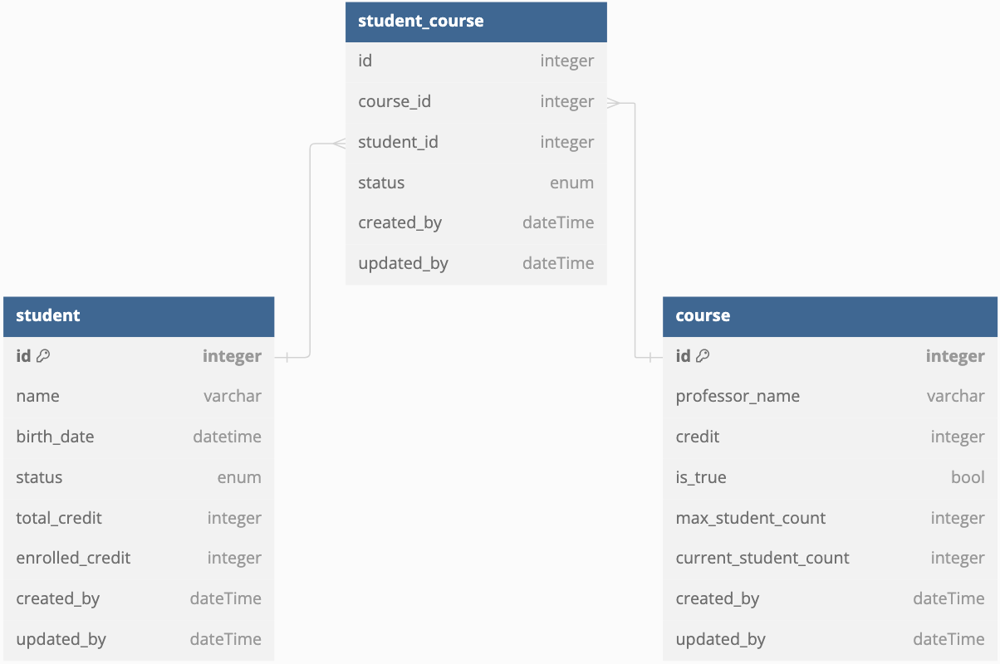

# 42gg 7기 3회차

- @Embedded, @Embeddable
    - 임베디드 타입은 복합 값 타입으로 불리며, 새로운 값 타입을 직접 정의해서 사용하는 JPA의 방법을 말함
        
        ```java
        @Entity
        public class User {
            @Id
            @GeneratedValue(strategy = GenerationType.IDENTITY)
            private Long id;
            private String name;
            private String email;
            private String city; // 도시
            private String district; // 구
            private String detail; // 상세주소
            private String zipCode; // 우편번호
        }
        // 로 만들어진 entity를 수정해서
        
        @Entity
        public class User {
            @Id
            @GeneratedValue(strategy = GenerationType.IDENTITY)
            private Long id;
            private String name;
            private String email;
            @Embedded
            private Address address;
        }
        
        // Address.java
        @Embeddable
        @Data
        @AllArgsConstructor
        @NoArgsConstructor
        public class Address {
            private String city; // 도시
            private String district; // 구
            private String detail; // 상세 주소
            private String zipCode; // 우편번호
        }
        ```
        
        `user.setAddress(new Address("서울시", "강남구", "강남대로 123", "16427"));` 로 데이터를 추가 가능
        
        임베디드 타입을 null로 지정했을시 내부의 모든 column도 null인 것과 동일하다
        
        @Embeddable = 값 타입을 정의하는 곳
        
        @Embedded = 값 타임을 사용하는 곳
        
        임베디드 타입은 기본 생성자가 필수다.
        
- 연관 관계 설정
    - @OneToOne
        - 장단점
            
            ### **주 테이블에 외래키 위치 시**
            
            - 객체지향 개발자가 선호하는 방법이다.
            - JPA 매핑이 편리하다.
            - 장점 : 주 테이블만 조회해도 대상 테이블에 데이터가 있는지 확인할 수 있다.
            - 단점 : 대상 테이블이 비어있으면 외래 키에 null이 들어간다.
            
            ### **대상 테이블에 외래키 위치 시**
            
            - 대상 테이블에 외래키를 위치시킨다.
            - 데이터베이스 개발자가 선호하는 방법이다.
            - 장점 : 주 테이블과 대상 테이블을 일대일 관계에서 이후 일대다 관계로 변경할 때 용이하다.
            - 단점 : 프락시 기능의 한계로 지연 로딩으로 설정해도 항상 즉시 로딩되게 된다.
        
    - @ManyToOne
        
        **가장 많이 사용하는 연관관계**로 여러 개(Many)가 한 개(One)에 속해있는 것
        
        ```java
        @Entity
        public class Member {
            @Id @GeneratedValue
            private Long id;
            
            private String username;
        
            @ManyToOne
            @JoinColumn(name = "TEAM_ID")
            private Team team;
        }
        // 실 mappedBy가 없는 쪽이 주인이며, 실제 FK를 가진 곳이 주인이어야함.
        // 위 경우 team_id라는 FK가 생성된 것
        // 다대일, 일대다 관계에서는 항상 다 쪽이 외래 키를 가진다.
        // 다 쪽인 @ManyToOne은 항상 연관관계의 주인이 되므로 mappedBy를 설정할 수 없다.
        // 따라서 @ManyToOne에는 mappedBy 속성이 없다.
        
        // 단방향
        @Entity
        public class Team {
            @Id @GeneratedValue
            @Column(name = "TEAM_ID")
            private Long id;
            private String name;
        }
        
        // 양방향
        @Entity
        public class Team {
            @Id @GeneratedValue
            @Column(name = "TEAM_ID")
            private Long id;
            private String name;
        
            @OneToMany(mappedBy = "team")
            private List<Member> members = new ArrayList<>();
        }
        
        // 하지만 Team에서 get한 member는 읽기 전용으로 수정해도 실제 db는 바뀌지 않는다.
        // 이를 수정하기 위해서는 member에 편의 메서드를 추가해서 사용한다.
            
        public void changeTeam(Team team){
            this.team = team;
            team.getMembers().add(this);
        }
        ```
        
        **@ManyToOne**은 가장 많이 사용하는 기본적인 매핑 방법이고, **가장 권장되는 방법**이다.
        
        @ManyToOne 매핑 시에 추가로 @OneToMany(mappedBy = "xxx")을 통해 양방향 매핑으로 설정할 수 있지만, 이 부분은 항상 사용하길 권장되진 않는다.
        
    - @OneToMany
        
        ```java
        @Entity
        public class Team {
            @Id @GeneratedValue
            @Column(name = "TEAM_ID")
            private Long id;
            private String name;
        
            @OneToMany
            @JoinColumn(name = "TEAM_ID")
            private List<Member> members = new ArrayList<>();
        }
        
        @Entity
        public class Member {
            @Id
            @GeneratedValue
            private Long id;
            private String username;
        }
        
        @Entity
        public class Member {
            @Id
            @GeneratedValue
            private Long id;
        
            private String username;
            
            @ManyToOne
            @JoinColumn(name = "TEAM_ID", insertable = false, updatable = false) //읽기 전용으로 설정
            private Team team;
        }
        
        // 양방향은 공식적으로 지원하는게 아니므로 사용을 지양해야한다.
        ```
        
        이 경우에는 Member객체에는 TEAM관련 속성이 없지만, MEMBER 테이블에는 TEAM_ID(FK)가 존재하게 된다.
        
        즉, 엔티티가 관리하는 FK가 다른 테이블에 존재하게 된다.
        
        또한 Team을 건드렸는데 Member에 대한 UPDATE SQL이 보내지기 때문에 권장하지 않는 방법이다.
        
        그리고 Team에서 members가 필요하더라도 ManyToOne 양방향 매핑을 사용하는 게 더 나은 방법이다.
        
    - @ManyToMany
        
        상품과 회원의 구매내역같은 관계에서, 누가 구매했는지 등 정보가 있으려면 가운데 구매내역이란 테이블을 만들어야하고, 그 경우에서 중간테이블에 정보를 추가하면 @ManyToOne, @OneToMany가 될 수 밖에 없다. 
        
        하지만 그냥 다대다로 연결 할 경우에는 데이터를 조회할 때 있어 원하지 않는 상황이 발생할 가능성이 매우 높으므로, 실제로는 사용하지 않고 중간테이블을 만든다.
        
    - 중간 테이블
        
        다대다관계의 단점을 극복하기 위해서는, @ManyToOne, @OneToMany를 받고있는 중간 테이블을 작성해서, Entity급까지 만들어서 중간테이블을 제작한다.
        
    - 연관관계의 주인
        
        엔티티를 양방향 연관관계로 설정하면 객체의 참조는 둘인데 외래 키는 하나다.
        
        이런 차이로 인해 JPA에서는 두 객체 연관관계 중 하나를 정해서 테이블의 외래키를 관리해야 하는데 이것을 연관관계의 주인이라 한다.
        
    - PK, FK
        - 기본 키(Primary Key, PK) ****각 데이터를 고유하게 식별하는 용도
        - 외래 키(Foreign Key, FK) 다른 테이블에 있는 기본 키를 참조해서 사용할 때
- ERD작성
    - 학생들이 수강신청을 하는 홈페이지를 만들 예정입니다.
        - 학생은 이름과 비밀번호를 필수로 가지고 있습니다.
        - 강의는 교수명, 강의이름, 현재 신청인원을 필수로 가지고 있습니다.
        - 강의를 신청하려면 학생 이름과 비밀번호를 입력해야합니다.
- 작성한 ERD를 [https://dbdiagram.io/](https://dbdiagram.io/) 로 만들어서 제출
- 3일차 md으로 작성해서 pr
- erd는 사진으로 제출

| student | student_course | course | baseEntity |
| --- | --- | --- | --- |
| @ManyToOne |  | @OneToMany |  |
| id | id | id | created_at |
| name | student_id | professor_name | updated_at |
| birth_date | course_id | credit |  |
| status(graduate, attend, drop) | status(enroll, cancel, success) | is_true |  |
| total_credit |  | max_student_count = 10 |  |
| enrolled_credit |  | current_student_count |  |

