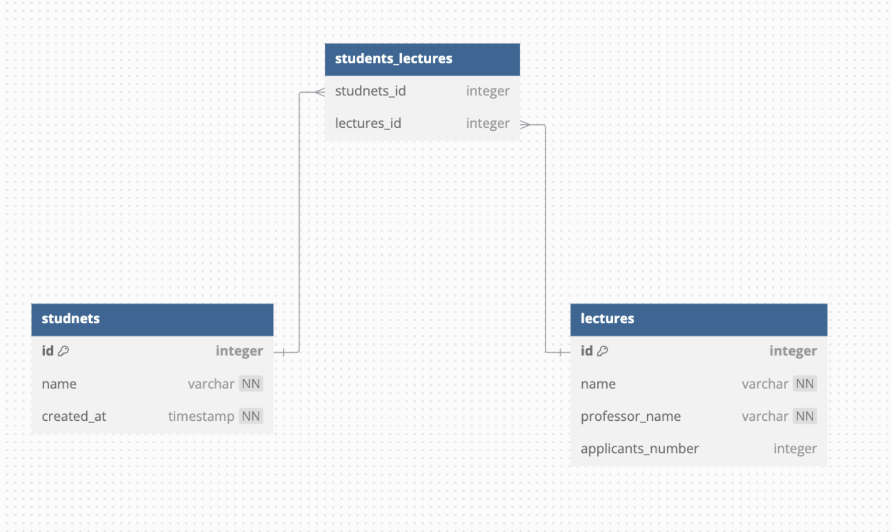

# 3일차

## @Embeddable,@Embedded

### @Embeddable

- 값 타입을 정의하는 클래스에 선언
- 해당 클래스가 다른 엔티티의 일부로 포함될 수 있음을 나타냄
- 독자적인 생명주기가 없음

### @Embedded

- 값 타입을 사용하는 엔티티의 필드에 선언
- @Embeddable로 정의된 값 타입을 포함함을 나타냄
- 엔티티의 일부로 테이블에 매핑됨

### 주의점

- 테이블 구조 유지
    - @Embeddable 클래스의 필드들은 해당 클래스를 포함하는 엔티티의 테이블에 직접 컬럼으로 매핑
    - 별도의 테이블이 생성되지 않음
- 컬럼 이름
    - @Embeddable 클래스의 필드명이 그대로 컬럼명으로 사용
    - @AttributeOverride를 사용하여 컬럼명을 재정의할 수 있음
- 중첩 @Embeddable
    계층 구조가 생성되지 않고 모든 필드가 같은 레벨의 컬럼으로 생성됨
- 관계 매핑
    - @Embeddable 클래스 내에 @ManyToOne 등의 관계가 있으면, 해당 관계에 대한 외래 키 컬럼이 테이블에 추가됩니다.
- NULL 처리
    - @Embeddable 객체가 null이면 관련된 모든 컬럼이 NULL로 설정 됨

## 데이터베이스 연관 관계 설정

### @OneToOne (1:1)

- 양쪽 엔티티가 서로 하나의 관계만 가짐

### @ManyToOne (N:1)

- 다대일 관계에서 가장 많이 사용
    - 조회 성능이 좋음
    - 조인 쿼리가 단순함
- 외래키는 항상 다(N)쪽에 있음

### @OneToMany (1:N)

- 일대다 관계
- 컬렉션을 사용하여 여러 엔티티 참조

### @ManyToMany

- 중간 테이블이 자동으로 생성됨
- 보통 중간 테이블을 엔티티로 승격하여 사용
- 실무에서 사용을 지양
    - 중간 테이블에 대한 세밀한 제어 불가
    - 복잡한 비즈니스 로직 구현의 어려움
    - 확장성 제한

### 연관 관계 설정시 주의점

- 연관관계 편의 메서드 구현
    - 어떤 엔티티의 값을 변경할 때 연관 되어 있는 모든 엔티티에도 값을 변경

### 중간테이블

- @ManyToMany 관계인 경우 사용
- 다대다 관계를 일대다 다대일 관계로 만들어줌

### 연관관계의 주인

- 외래 키가 있는 곳이 연관관계의 주인
- mappedBy 속성으로 주인 지정
- 주인만이 외래 키를 관리할 수 있음

## PK(Primary Key), FK(Foreign Key)

### PK(Primary Key)

- 테이블의 각 레코드를 고유하게 식별하는 키
- NULL 값을 가질 수 없음
- 중복된 값을 가질 수 없음

### Foreign Key

- 다른 테이블의 PK를 참조하는 키
- 테이블 간의 관계를 정의
- NULL 값 허용 가능
- 중복된 값 허용 가능

